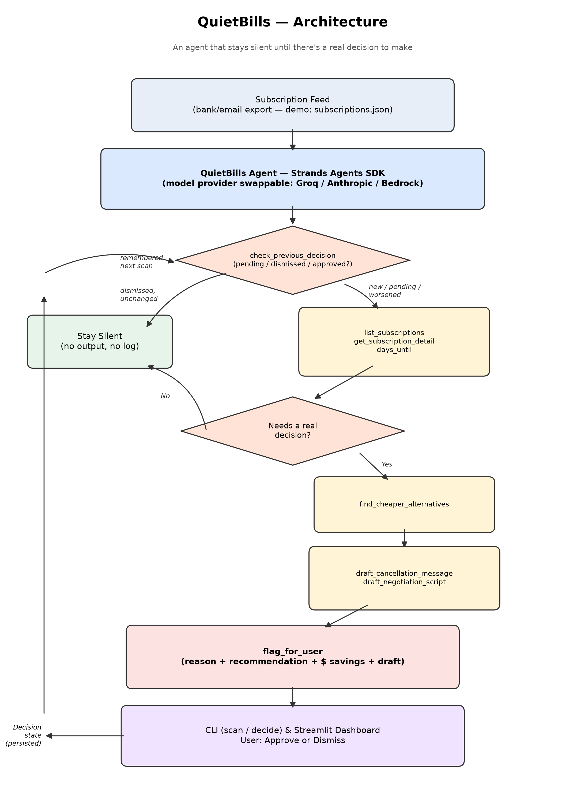
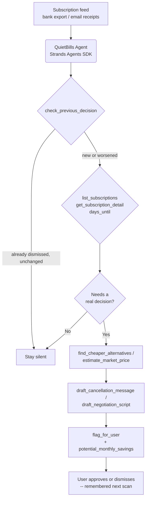

# QuietBills

**An agent that watches your recurring bills and subscriptions and only talks to you when there's a real decision to make.**

Built for the [Agents for Humans Hackathon](https://agentsforhumans.devpost.com) — Everyday Agents track.



## The problem

Everyone has 6-15 recurring subscriptions and bills. Prices creep up a dollar or two at a time, trials silently convert to paid plans, and gym memberships or meal kits renew for months after you've stopped using them. Nobody wants to open every account monthly and audit it by hand — so it just doesn't happen, and it quietly costs real money.

## Who it's for

Anyone with more than a couple of recurring subscriptions — which is most people. No finance background or manual bookkeeping required.

## Why it matters

The fix isn't "another dashboard to check." It's an agent that does the checking *for* you and stays completely silent unless something actually needs your judgment: a price hike, a renewal you clearly aren't using, or a due date with no safe default. That's the difference between an app you have to manage and an agent that manages something for you.

## How it works

QuietBills is a [Strands Agents](https://strandsagents.com/) agent with nine narrow tools. It reviews each tracked subscription and reasons about whether it crosses one of three thresholds:

- **Price hike** — the upcoming renewal price is meaningfully higher than recent history.
- **Unused renewal** — no use in 45+ days and a renewal is coming up.
- **Time-sensitive** — renewal within 3 days combined with either of the above.

If none of those apply, the agent does nothing — no notification, no log entry, no noise. If one does, it checks whether you've already seen this exact issue before, looks up cheaper alternatives, decides on a recommendation (cancel / negotiate / downgrade), estimates the dollar impact, drafts the actual email or phone script, and surfaces just that one decision to the user.



### Tools

| Tool | Purpose |
|---|---|
| `list_subscriptions` | Enumerate everything being tracked |
| `get_subscription_detail` | Full price history for one subscription |
| `days_until` | Days remaining until a date, for renewal urgency |
| `check_previous_decision` | Recall whether this was already flagged/approved/dismissed, so nothing gets re-nagged |
| `find_cheaper_alternatives` | Look up cheaper options in the same category (static reference set) |
| `estimate_market_price` | A second, LLM-reasoned opinion on whether the price is above typical market rate |
| `draft_cancellation_message` | Write a ready-to-send cancellation email |
| `draft_negotiation_script` | Write a retention-call script |
| `flag_for_user` | The *only* tool that produces user-visible output — surfacing a decision with an estimated dollar impact |

Everything except `flag_for_user` is silent bookkeeping. The agent's system prompt (see [`quietbills/agent.py`](quietbills/agent.py)) instructs it to call `flag_for_user` only when a subscription genuinely needs a human decision, and to do nothing otherwise — the "quiet by default" behavior is a prompted policy enforced by the tool boundary, not a UI filter bolted on afterward.

Each subscription is reviewed by its own fresh agent instance, so one subscription's tool-call hiccup can't derail the rest of the scan, and reasoning about one subscription never bleeds into another.

In this demo, the subscription feed is a local JSON file ([`data/subscriptions.json`](data/subscriptions.json)) standing in for a real bank/email export — swapping `data_store.load_subscriptions()` for a live connector (Plaid, Gmail receipt parsing, etc.) is the only change needed to move from demo data to a real feed.

### Memory across runs

Every flag is written to `data/decision_state.json`, keyed by subscription. When you record a decision:

```bash
python -m quietbills.cli decide cloudsafe approve   # or: dismiss
```

the next scan won't re-flag that exact issue unless it's gotten worse (bigger price hike, still unused much later). Dismissing something is a real decision to leave it alone for now, not a bug to be nagged about again tomorrow.

## Setup

Requires Python 3.11+.

```bash
python -m venv .venv
.venv/Scripts/activate   # or `source .venv/bin/activate` on macOS/Linux
pip install -r requirements.txt
```

Choose a model provider:

**Option A — Anthropic API directly** (simplest to get running):

```bash
export ANTHROPIC_API_KEY=sk-ant-...
export QUIETBILLS_PROVIDER=anthropic
```

**Option B — Groq** (fast, free-tier friendly, OpenAI-compatible endpoint):

```bash
export GROQ_API_KEY=gsk_...
export QUIETBILLS_PROVIDER=groq
# defaults to openai/gpt-oss-120b; override with QUIETBILLS_MODEL_ID
```

**Option C — Amazon Bedrock** (default; needs an AWS account with Bedrock model access enabled and Claude models granted):

```bash
export AWS_REGION=us-east-1
# AWS credentials via the usual chain (aws configure, env vars, or an assumed role)
```

## Run it

```bash
python -m quietbills.cli scan
```

Reviews every tracked subscription and prints **only** the ones that need your input, each with a reason, a recommendation, and a ready-to-use draft. A healthy subscription list produces no output beyond "no decisions needed today."

```bash
python -m quietbills.cli chat
```

Ask QuietBills questions directly, e.g. "which of my subscriptions went up in price this year?"

```bash
streamlit run quietbills/webapp.py
```

A small dashboard: every subscription, flagged ones expanded with the reason and draft, a total potential monthly savings figure, and Approve/Dismiss buttons that feed the memory described above.

## Tests

The tool layer is unit-tested independent of any live model call, since the tools are the auditable surface the agent operates through:

```bash
pytest tests/ -v
```

## Deployment note

The agent is written against the standard `strands.Agent` interface, so it can be deployed behind [Amazon Bedrock AgentCore](https://aws.amazon.com/bedrock/agentcore/) for a hosted, scheduled version that runs on its own (e.g. a daily cron scan) rather than on demand from a CLI — a natural next step beyond this submission.

## License

MIT — see [LICENSE](LICENSE).
